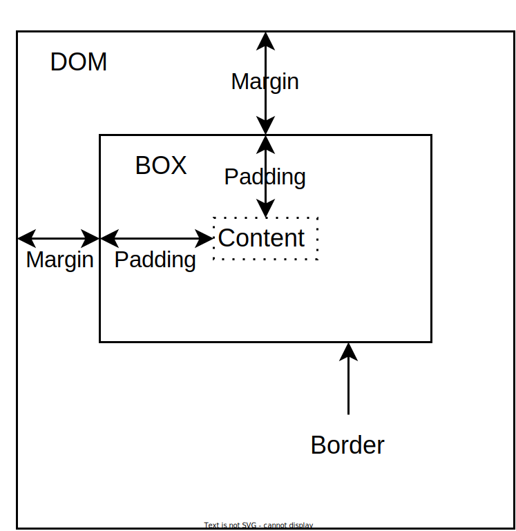

# Styling a document

In this project, TailwindCSS is used for styling. This is a CSS library containing many predefined `classes` that can be applied to HTML elements.

## Intro to colors

There are many different options when styling elements. For instance, to change the background color of an element, you can apply a style on the following format: `bg-[color]-[number]`. `color` refers to one of the available colors, and `number` refers to the strength of the color, `50` is the lowest, and `900` is the strongest. An example of a `div` with a dark gray background and white text within could be styled like this:

```html
<div className="bg-gray-700">
  <p class="text-white">Hello!</p>
</div>
```

## Intro to the box model

The box model is used to describe how content in HTML is essentially a bunch of boxes with a margin, border, padding, and content.



- <b>Margin</b>: Describes the amount of space around the box should be clear of other elements. This does not affect the size of the box, only displaces it relative to other boxes/elements. Example classes are `m-3` (all sides), `mx-1` (only x-axis), and `mt-2` (only up).
- <b>Border</b>: The border is the `edge` of the box. If applying a border, the box size will change accordingly, and is mostly used to enclose a box with a color. With Tailwind, `border` will apply a 1px wide line around the box.
- <b>Padding</b>: This is an "inner" margin. The content is placed within the box, but the size of the box will increase, such that the shortest path from the content to the border is the amount you set it to. `p-3`, `px-1`, and `pt-2` are examples of these classes.
- <b>Content</b>: This is the inside of the box, where content goes, e.g. `div` elements placed within the encapsulating element.

## Tailwind

- Tailwind uses standard numbers for colors (e.g. `bg-slate-200`): `50, 100, 200,..., 800, 900`.
- For sizes (e.g. `text-lg`), abbreviations are used: `xs, sm, md, lg, xl, 2xl, 3xl,...,7xl`.
- For box sizing (e.g. `p-3`), specific numbers are used: `0.5, 1, 1.5, 2..., 80, 96`. There are fewer options as the size increases.

There are too many styles to mention here, so take a look at [the Tailwind documentation](https://tailwindcss.com/docs/installation) if you want to see more examples. Use the navigation to the left to find different styles and specific size modifiers.
